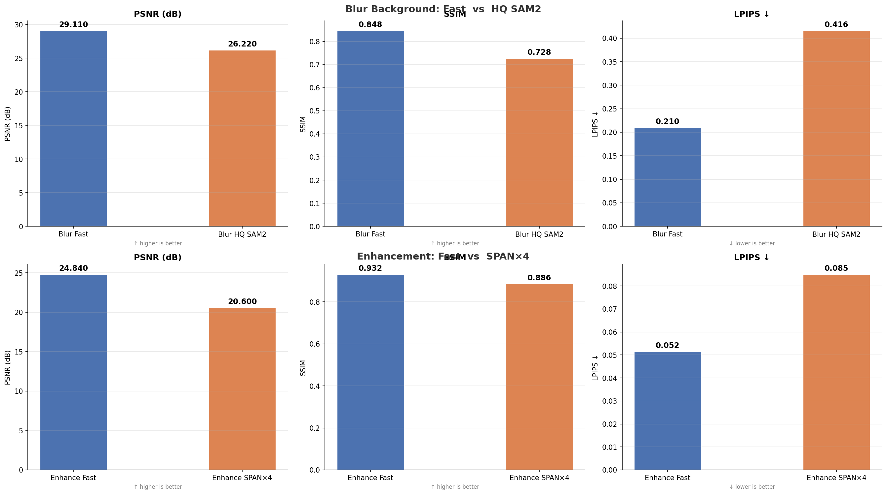
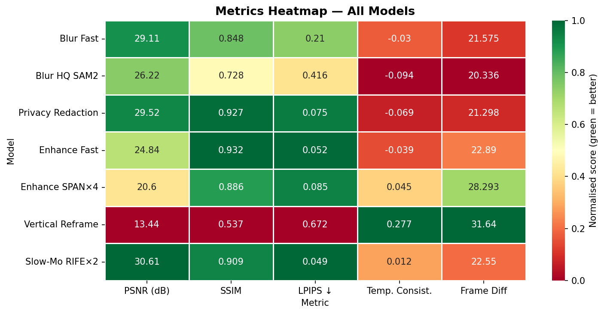
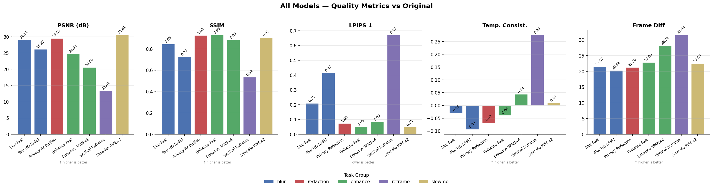
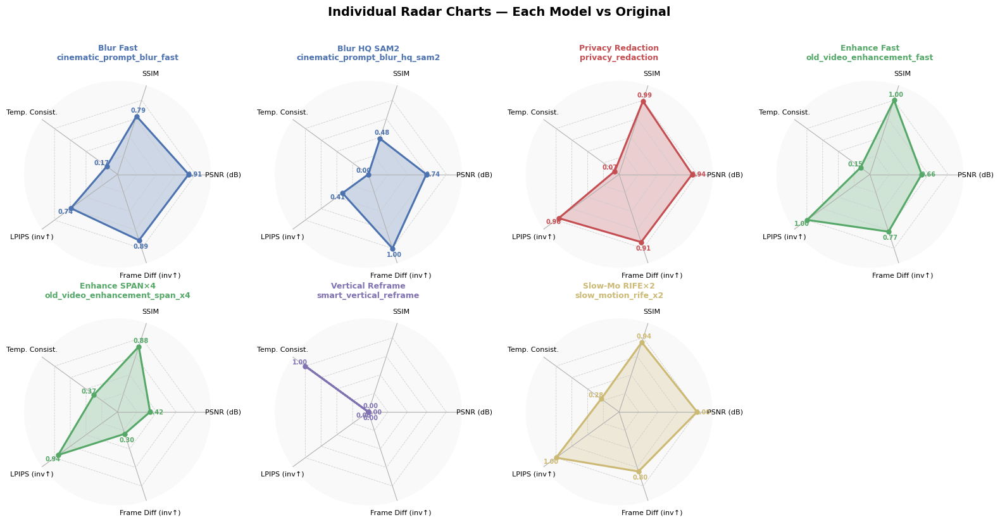

# VISUALine

VISUALine is a modular, node-based framework for automated video enhancement and visual editing. It integrates multiple computer vision models into reproducible pipelines for tasks such as prompt-based segmentation, background blur, privacy redaction, smart reframing, super-resolution, and video restoration.

The system is designed for efficient execution on consumer GPUs using optimized model loading, caching strategies, and mixed-precision inference. Its architecture enables flexible composition of processing stages while maintaining performance and scalability.

---

# Navigation

* [Overview](#visualine)
* [Installation](#installation)
* [Model Weights](#model-weights)
* [Explanation](#explanation)
* [Results & Comparison](#results--comparison)

---

# Installation

## 1. Clone the repository

```bash
git clone https://github.com/MO-87/VISUALine.git
cd VISUALine
git checkout develop
```

---

## 2. Create Conda environment

```bash
conda create -n VISUALine python=3.10
conda activate VISUALine
```

---

## 3. Install dependencies

```bash
pip install -r requirements.txt
```

---

## 4. Create required folders

The project structure should include:

```text
./VISUALine/weights
./VISUALine/export
```

Create them using:

```bash
mkdir weights export
```

---

# Model Weights

Download the following pretrained weights and place them inside `./VISUALine/weights`.

## Required Models

1. SAM2
   [sam2_hiera_small.pt](https://huggingface.co/facebook/sam2-hiera-small/blob/refs%2Fpr%2F1/sam2_hiera_small.pt?utm_source=chatgpt.com)

2. GroundingDINO
   [groundingdino_swinb_cogcoor.pth](https://huggingface.co/ShilongLiu/GroundingDINO/blob/main/groundingdino_swinb_cogcoor.pth?utm_source=chatgpt.com)

3. FlowNet (Wan2.1)
   [flownet.pkl](https://huggingface.co/DeepBeepMeep/Wan2.1/blob/main/flownet.pkl?utm_source=chatgpt.com)

4. Additional models (Google Drive folder)
   [Download additional weights](https://drive.google.com/drive/folders/1snn0Y8Fd8P7-OHtukGFenV7ST1QmXj-a?usp=drive_link&utm_source=chatgpt.com)

---

# Explanation

VISUALine is built around a **node-based execution engine**, where each operation is encapsulated as an independent module. Each node receives input tensors, processes them, and outputs transformed data to the next stage.

### Core Design Principles

* Modularity: every function is implemented as a reusable node
* Composability: workflows are constructed as linear or branched pipelines
* Efficiency: GPU acceleration with mixed precision where possible
* Memory control: model caching with controlled VRAM usage
* Extensibility: new nodes can be added without modifying the core engine

### Supported Processing Tasks

* Prompt-based object detection and segmentation
* Background blur and cinematic effects
* Privacy redaction (faces and people masking)
* Video enhancement and restoration
* Super-resolution upscaling
* Frame interpolation and slow motion generation
* Smart cropping and vertical reframing

---

# Results & Comparison

All outputs and evaluation visuals are located in the `img/` folder.

## Model Comparison

### Similar Models Comparison



This section compares different models that perform the same task but with different trade-offs. Some models are optimized for speed and low memory usage, while others prioritize accuracy and visual quality at the cost of higher computational demand.

To evaluate performance, three common image quality metrics are used:

**PSNR (Peak Signal-to-Noise Ratio)**
PSNR measures the similarity between a generated output and a reference ground truth image. It is expressed in decibels (dB). Higher PSNR values generally indicate better reconstruction quality and closer similarity to the original image.

* Higher PSNR = better quality
* Lower PSNR = worse quality

---

**SSIM (Structural Similarity Index Measure)**
SSIM evaluates perceived image quality by comparing structural information, luminance, and contrast between images. It is more aligned with human visual perception than PSNR.

* Higher SSIM = better structural similarity and quality
* Lower SSIM = worse quality

---

**LPIPS (Learned Perceptual Image Patch Similarity)**
LPIPS measures perceptual similarity using deep neural network features. It reflects how humans perceive image differences rather than pixel-level accuracy.

* Lower LPIPS = better perceptual quality
* Higher LPIPS = worse quality

---

### Metrics Heatmap



### Model Metrics Overview



### Sample Output



---

# Execution

## Run main application

```bash
python main.py
```

## Launch GUI (if available)

```bash
python app.py
```

---

# Notes

* Ensure all weights are correctly placed inside `./VISUALine/weights`
* Exported results will be saved in `./VISUALine/export`
* GPU is recommended for real-time performance
